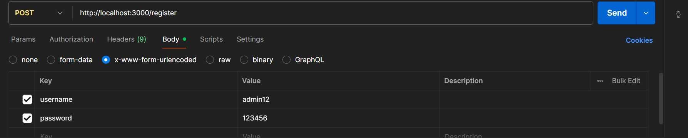
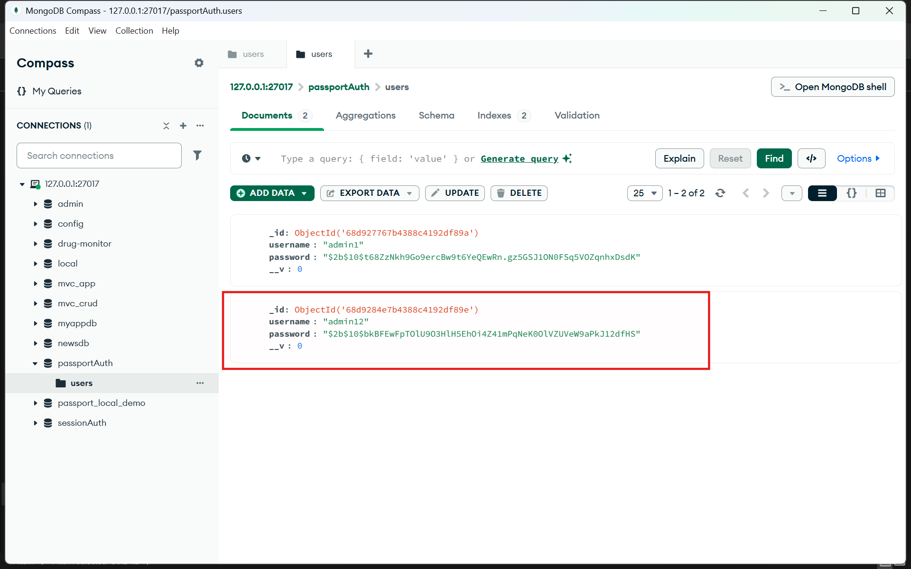
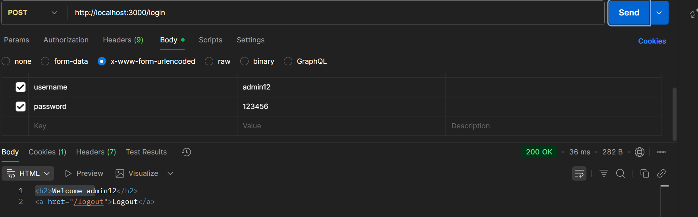
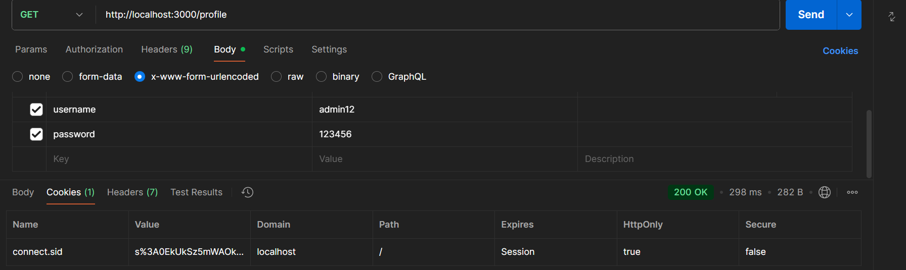
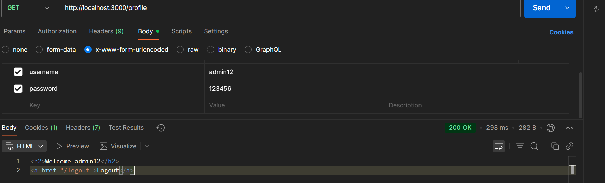
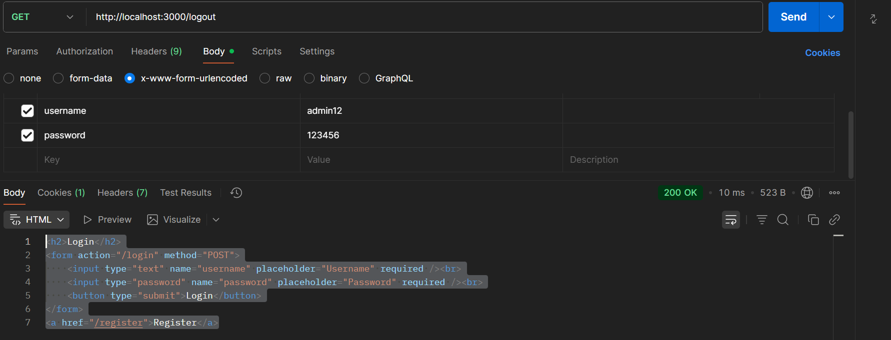

# Local Passport Website

## Giới thiệu
Đây là project thực hành **Authentication với Passport.js (LocalStrategy)** kết hợp **Session + Cookie** và MongoDB.  
Ứng dụng triển khai các chức năng cơ bản:
- Đăng ký (Register)
- Đăng nhập (Login)
- Xem profile (Profile)
- Đăng xuất (Logout)

Session được quản lý bởi **express-session**, lưu vào MongoDB thông qua `connect-mongo`.  
Passport sẽ xác thực user dựa trên `username` và `password` đã được hash bằng **bcryptjs**.

---

## Cài đặt & Chạy

### 1. Clone project
```bash
git clone https://github.com/Tiuquoai/local_passport_website.git
cd local_passport_website
# a. Register

URL: http://localhost:3000/register

Method: POST

Body (x-www-form-urlencoded):

username: admin1

password: 123456
**Ảnh test:**  
- Form Register:  
  
- User lưu vào DB:  

Kết quả: User mới được lưu vào DB. Redirect về trang login.

# b. Login

URL: http://localhost:3000/login

Method: POST

Body (x-www-form-urlencoded):

username: admin1

password: 123456
**ảnh test:** 
  
- Cookie lưu trong Postman:  

Kết quả: Nếu đúng → redirect sang /profile (hiện Welcome admin1).
Nếu sai → quay lại trang login.

# c. Profile

URL: http://localhost:3000/profile

Method: GET

Kết quả: Hiện thông tin user (HTML view), ví dụ:

<h2>Welcome admin1</h2>
<a href="/logout">Logout</a>

Nếu chưa login → redirect về trang login.
ảnh test:


# d. Logout

URL: http://localhost:3000/logout

Method: GET

 Kết quả: Session bị xoá, redirect về /login.
 ảnh test:
